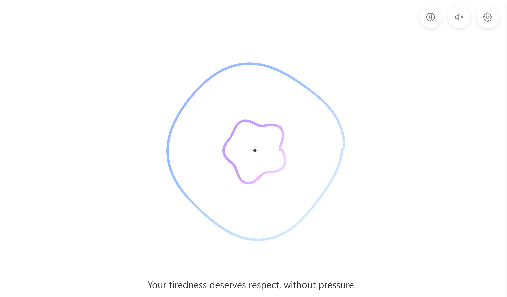
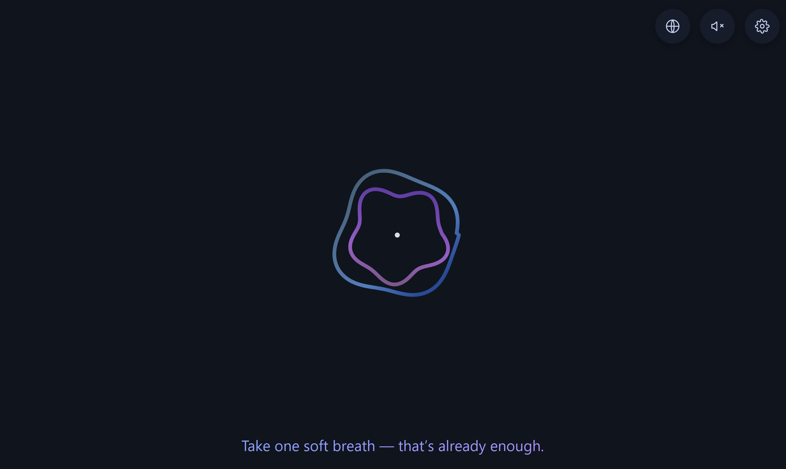
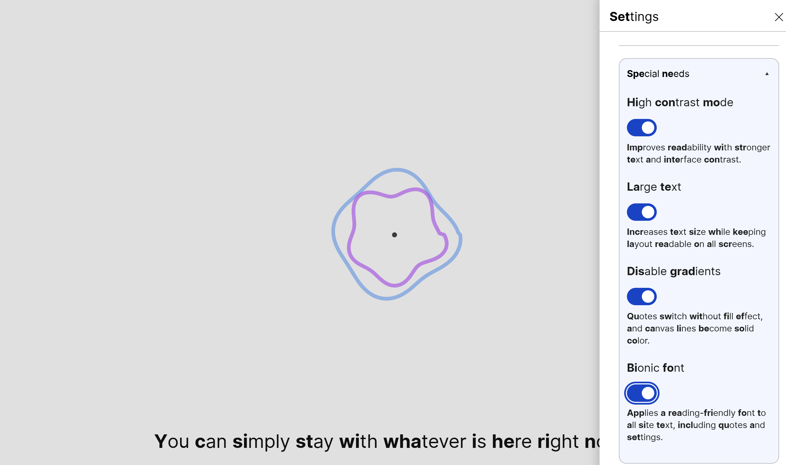

# Breath slow

Breath slow is a lightweight browser breathing companion for panic, stress, and overwhelm.
It opens instantly in the browser — no install, no account, no backend.

**Current version:** 1.01.01

Version format: `MAJOR.MINOR.PATCH` (example: `1.01.01`).
Use `PATCH` for small fixes/text updates, `MINOR` for noticeable features/UX changes, `MAJOR` for breaking or large architecture changes.

**Live (primary):** [https://breathe-slow.app/](https://breathe-slow.app/)  
**Live (technical mirror / GitHub Pages):** [https://alena-savchenko.github.io/breathe/](https://alena-savchenko.github.io/breathe/)

> Supportive self-help tool, not a medical service.

## Preview

<p align="center">
  
  
</p>

## Features

- Guided breathing animation with adjustable speed (BPM)
- Interactive violet line (mouse / touch)
- Quote rotation synced to breathing cycles
- Optional background music with volume and BPM-linked playback
- First-visit tutorial with replay from Settings
- Languages: English, Русский, Українська, Deutsch
- Keyboard-friendly navigation

## Settings

- Breathing speed, quote cadence, and line thickness
- Music toggle and volume
- Theme switch (light/dark)
- Language switcher
- Tutorial replay

Preferences are stored locally in `localStorage`.

## Special needs (Accessibility)

Dedicated accessibility options for calmer visuals and easier reading:

- High contrast
- Large text
- Disable gradients
- Bionic font

You can enable all options together or only the ones you need.

<p align="center">
  
</p>

## Run locally

```bash
# Python 3
python -m http.server 8080

# Node
npx serve .
```

Open: `http://localhost:8080`

## Project layout

```text
.
├─ index.html
├─ assets/
│  ├─ css/styles.css
│  ├─ js/{breath.js, script.js}
│  ├─ preview/OG-preview.png
│  ├─ fonts/fast-font/*
│  └─ audio/music/*
├─ i18n/
│  ├─ en/{messages.txt,ui.txt}
│  ├─ ru/{messages.txt,ui.txt}
│  ├─ uk/{messages.txt,ui.txt}
│  └─ de/{messages.txt,ui.txt}
└─ .github/assets/{demo_light.png, demo_dark.png, demo_special_needs.png}
```

## Docs

- Credits and licenses: `CREDITS.md`
- Audio sources: `assets/audio/music/SOURCES.md`
- Font sources: `assets/fonts/fast-font/SOURCES.md`
