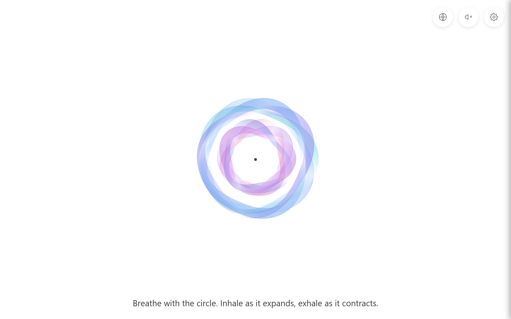
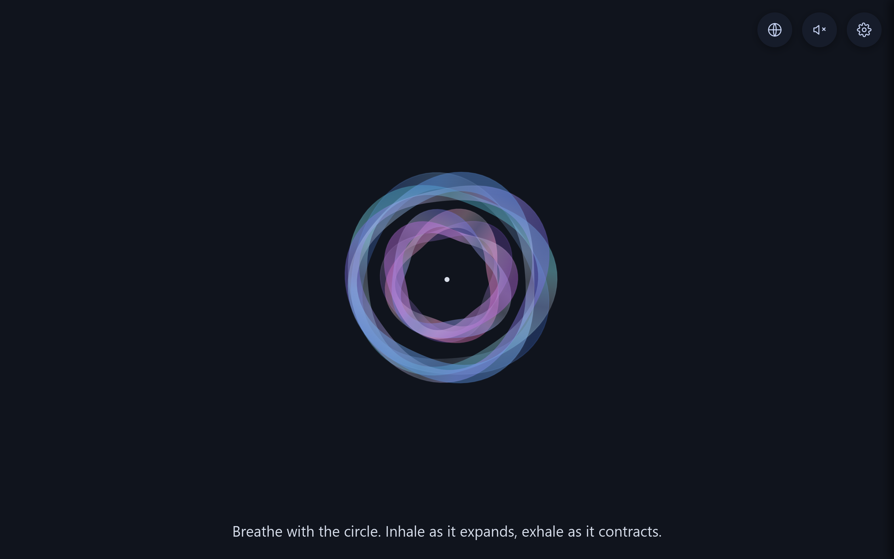
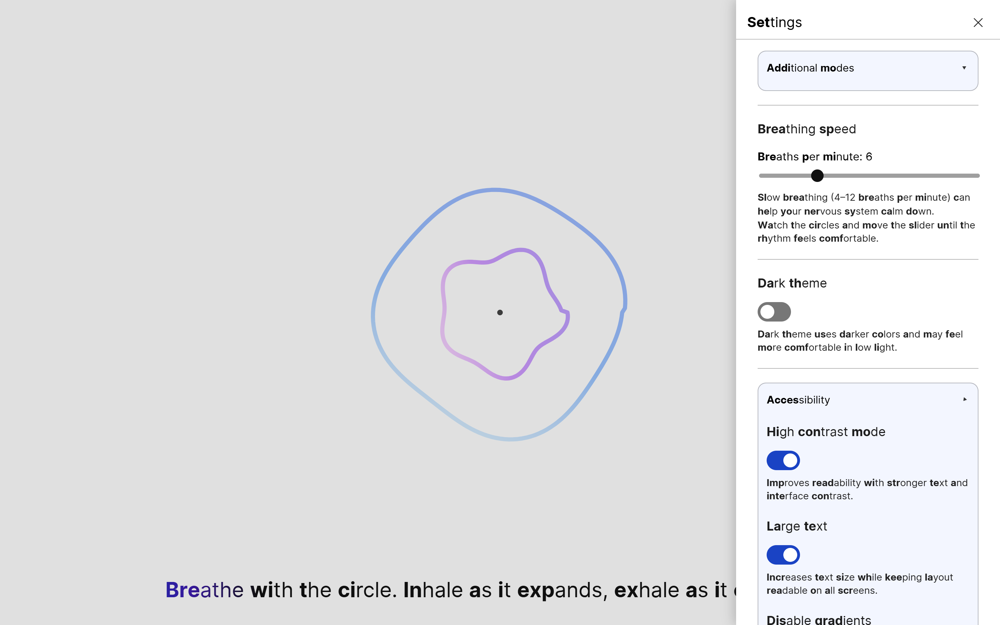

# Breath Slow

Breath Slow is a quiet place to pause when breathing feels rushed, thoughts are crowded, or you simply need a few calmer minutes.

Open it in a browser, follow the moving circles, and breathe at a pace that feels comfortable. There is no account, no installation, and nothing to set up before you begin.

**[Open Breath Slow](https://breathe-slow.app/)**

> Breath Slow is a supportive self-help tool, not a medical service.

<p align="center">
  
  
</p>

## Just follow the circle

Inhale as the circle expands and exhale as it contracts. If watching is not enough to hold your attention, move your finger or mouse with the shape. The motion gives your eyes, breath, and hand one simple rhythm to follow.

The regular mode lets you choose a comfortable speed. Additional modes offer a longer exhale, box breathing, a physiological sigh, and a gentler pattern for moments of hyperventilation. You can always return to ordinary even breathing.

## Make it comfortable for you

Breath Slow can be adjusted without turning the exercise into a complicated setup:

- choose a breathing rhythm and speed;
- use the light or dark theme;
- make the lines thicker or simplify their movement;
- turn on optional music and set its volume;
- enable larger text, higher contrast, reduced gradients, or the alternative reading font;
- use the interface in English, Russian, Ukrainian, or German.

Your preferences stay in your browser. Music always starts switched off when the page opens.

<p align="center">
  
</p>

## Read at your own pace

The site includes two short guides in all four languages:

- **[About breathing](https://breathe-slow.app/eng/about-breathing.html)** explains how breathing and the nervous system affect each other, when a breathing exercise may help, and when medical care matters more.
- **[Frequently asked questions](https://breathe-slow.app/eng/faq.html)** covers depth, tempo, pauses, dizziness, discomfort, and choosing a pattern that suits you.

## Accessible from the start

The breathing state is announced to screen readers without repeating on every animation frame. The controls work with a keyboard, the page respects reduced-motion preferences, and the first screen remains scrollable on touch devices. The basic interface and reading pages are available offline after they have been cached.

## Run it locally

Breath Slow is a small static site with no framework or build step.

```bash
python -m http.server 8080
```

Then open `http://localhost:8080`.

The source is available under the [MIT License](LICENSE). Credits for the optional music and font are listed in [CREDITS.md](CREDITS.md).

**Current version:** 1.01.04
